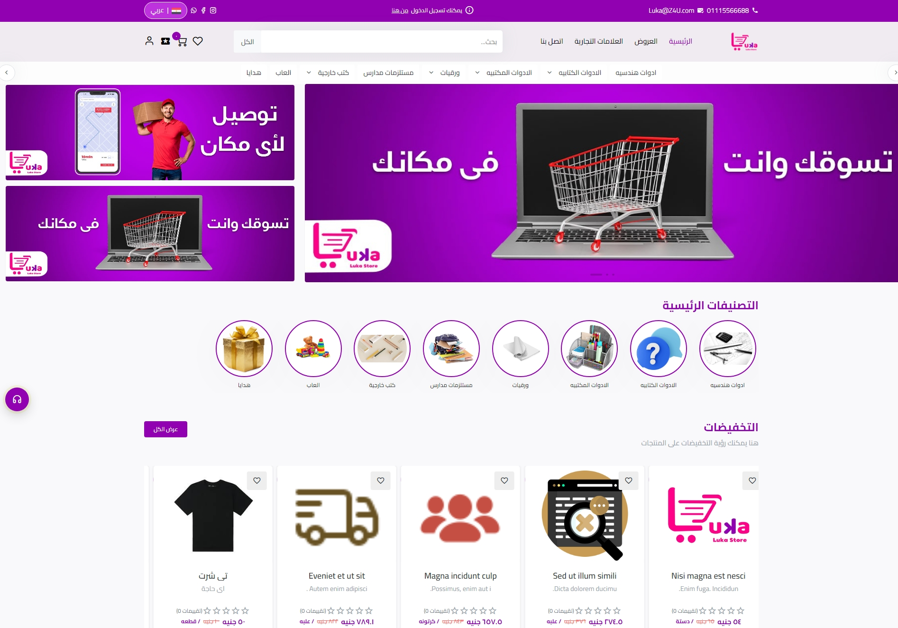
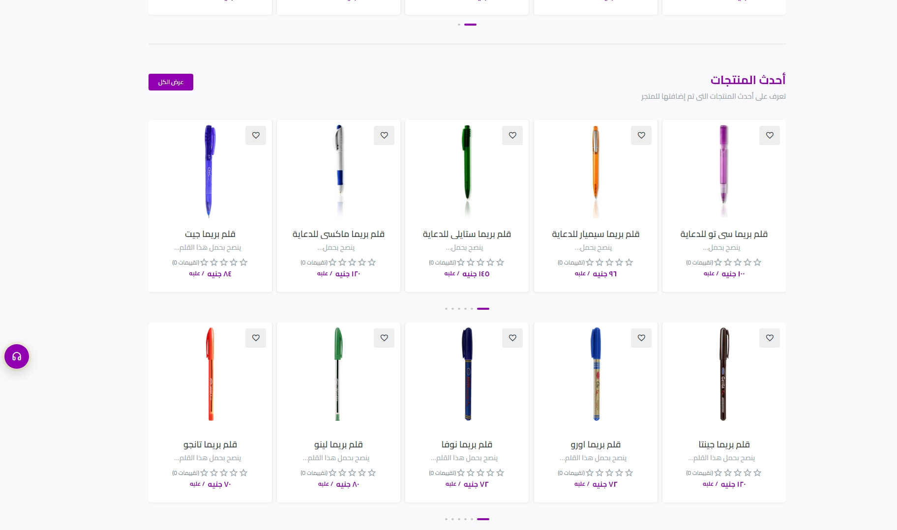
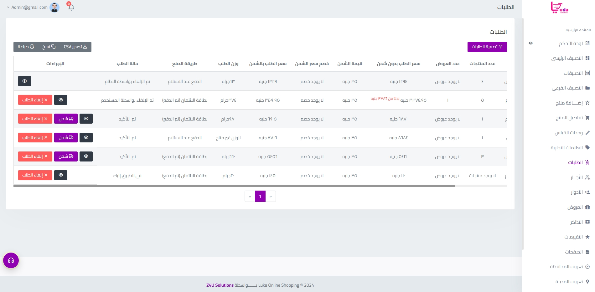
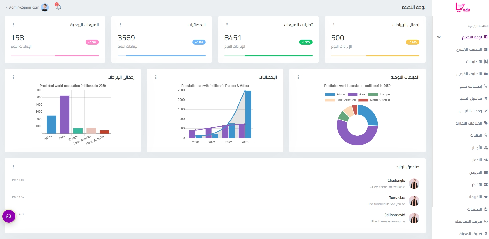

# Luka E-commerce Platform

This repository showcases a demo of an advanced e-commerce platform developed for Z4U, integrated with an ERP system to streamline business operations such as inventory management, order processing, and customer data handling.

## Project Overview

Luka is a scalable e-commerce solution built to handle high-traffic environments while ensuring seamless user experience and efficient backend performance. The platform is designed to support robust integration with ERP systems, making it ideal for businesses looking to optimize their online sales processes.

### Key Features

- **Backend Optimization**: Enhanced system performance with caching strategies and query optimization, achieving a 45% increase in speed and a 30% improvement in system availability.
- **Real-Time Communication**: Utilized WebSocket (SignalR) for real-time updates, enabling instant synchronization of orders and inventory between the e-commerce platform and ERP.
- **Secure Authentication**: Implemented JWT-based authentication to ensure data security and user verification.
- **Scalable Architecture**: Built with ASP.NET Web API and Entity Framework, providing flexibility and scalability to accommodate growing business needs.
- **ERP Integration**: Seamlessly integrated ERP functionalities for managing inventory, processing orders, and customer relationship management, reducing manual processes and improving overall efficiency.

## Technologies Used

- **Backend**: ASP.NET Web API, Entity Framework, Dapper, Redis (Distributed Caching)
- **Authentication**: JWT (JSON Web Tokens)
- **Real-Time Features**: SignalR for WebSocket communication
- **Database**: SQL Server for structured data storage
- **Cloud Services**: Microsoft Azure for hosting and scaling

## Demo

View the live demo [here](http://2.58.80.186/).

## Project Structure

- **/Docs**: Contains project documentation and detailed explanations of key components.
- **/Images**: Includes screenshots of the platform's features and UI.
- **/DatabaseScripts**: SQL scripts used for database schema and structure.

## Screenshots

|  |  |
|:-----------------------------:|:-----------------------------------:|
| Home Page                     | Home Page 2                         |

|  |  |
|:-----------------------------------------------:|:----------------------------------------:|
| Order Management Interface                      | ERP Dashboard Integration                 |

## How to Use

1. **Setup**: Clone this repository to your local machine and navigate to the project directory.
2. **Dependencies**: Install required NuGet packages and set up the SQL Server database using the provided scripts.
3. **Configuration**: Update the connection strings and JWT settings in the `appsettings.json` file.
4. **Run the Application**: Launch the project using Visual Studio or through the command line with `dotnet run`.

## Note

This project is intended for demonstration purposes. The source code is private due to client confidentiality. For inquiries about similar projects or to discuss potential collaborations, feel free to reach out.

## Contact

For more details or if you have any questions, please contact me:

- **Email**: [sayed.work223@gmail.com](mailto:sayed.work223@gmail.com)
- **LinkedIn**: [Sayed Elmahdy](https://www.linkedin.com/in/sayed-elmahdy365)
- **GitHub**: [Sayedelmahdy](https://github.com/Sayedelmahdy)
